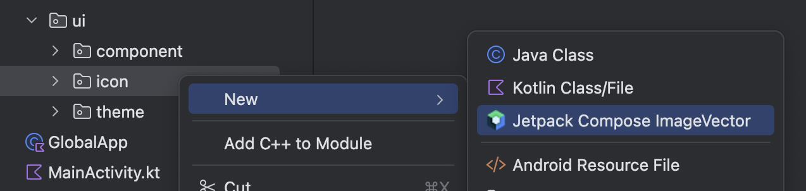
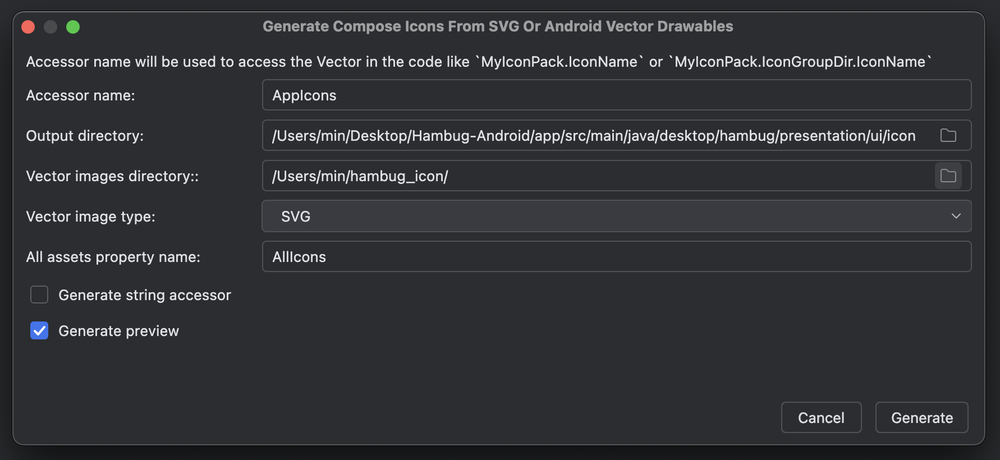

  

    
  

   
  <h2>Plugins</h2>
  
플러그인 관련 내용 정리

   
   

## 🔥 Svg to Compose

### Svg to Compose 플러그인

해당 플러그인은 SVG 파일을 Compose용 ImageVector로 변경할 수 있다

 

### 플러그인 설치

Android Studio에서 Settings ➡️ Plugins ➡️ [ svg to compose ] 검색해서 설치

 

### 변환하기

- File ➡️ New ➡️ [ Jectpack Compose ImageVector ] 클릭

 

- 내용들 입력 후 [ Generate ] 클릭

👉 Accessor name : ImageVector에 접근하기 위한 이름

👉 Output directory : 변환된 ImageVector 들이 출력될 디렉토리 경로

👉 Vector images directory : SVG 파일들이 포함된 디렉토리 경로

👉 Vector image type : SVG 선택

👉 All assets property name : 변환된 아이콘 목록의 변수명

 

- 설정한 경로(Output)에 파일들이 생성된다

 

- Accessor name과 파일명을 통해 ImageVector에 접근 가능

