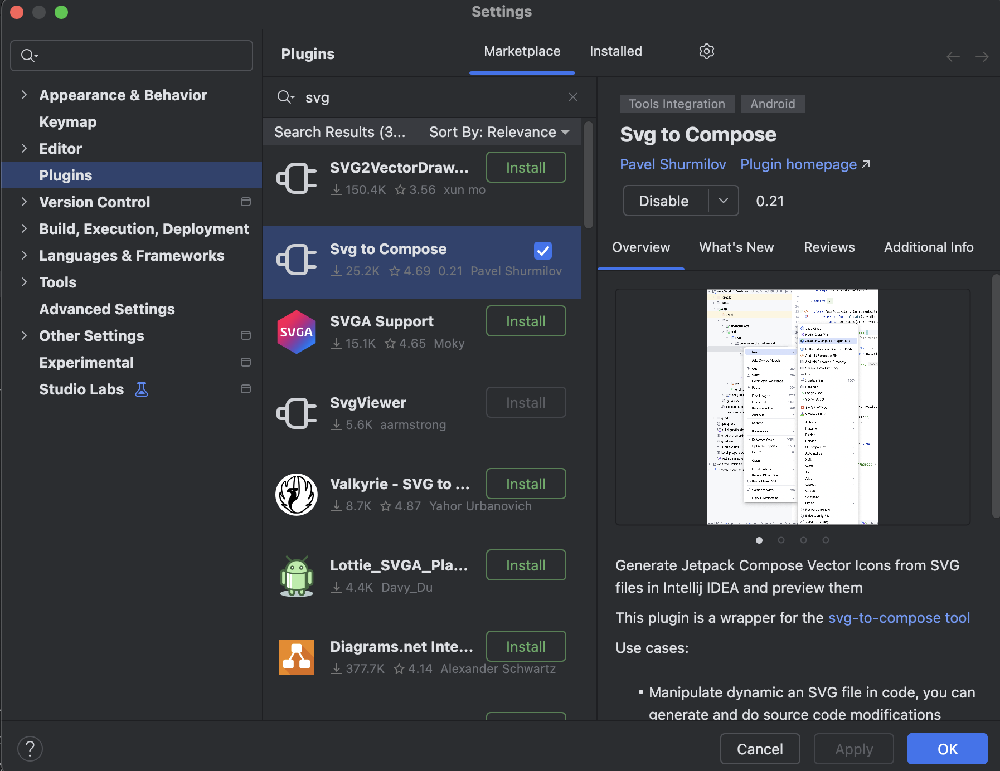
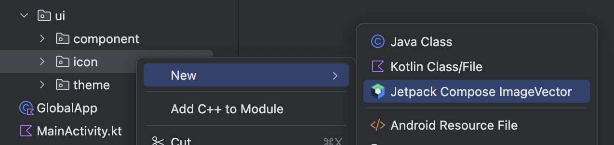
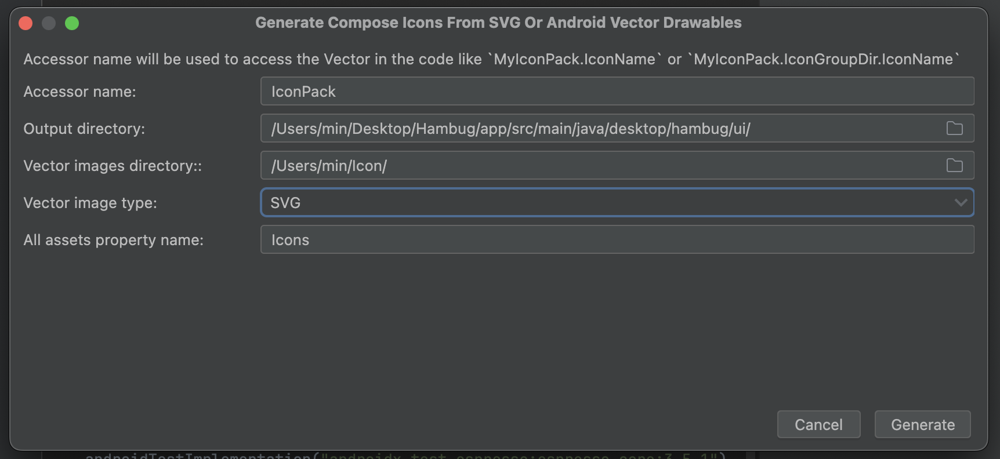
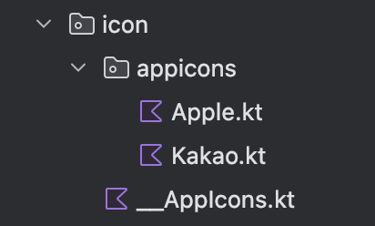
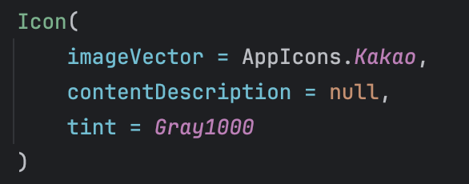

  

    
  

   
  <h2>Plugins</h2>
  
플러그인 관련 내용 정리

   
   

## 🔥 SVG to Compose 플러그인

### 목적

`SVG to Compose` 플러그인은 SVG 파일을 Compose에서 사용 가능한 `ImageVector` 코드로 변환해준다

👉 디자이너가 제공한 SVG를 그대로 코드로 변환해 활용할 수 있으므로,

- XML 기반의 `VectorDrawable`을 따로 관리하지 않아도 되고
- Compose 코드 안에서 일관되게 아이콘을 사용할 수 있다

 

### 플러그인 설치

1. Android Studio → Settings → Plugins
2. "svg to compose" 검색 후 설치

 

### SVG → ImageVector 변환 과정

1. ui 폴더 하위에 icon 폴더 생성

   → 해당 폴더 우클릭 → New →  Jectpack Compose ImageVector 클릭

   

 

2. 각 항목 입력 후 [Generate] 클릭

   - Accessor name : 아이콘 접근 시 사용할 객체 이름

   - Output directory : 변환된 파일이 저장될 경로

   - Vector images directory : 변환할 모든 SVG 파일이 있는 폴더 지정

   - All assets property name : 모든 아이콘을 담는 이름

   

 

3. 지정한 경로에 `ImageVector` 파일들이 자동 생성된다

   

 

4. 생성된 Accessor name과 파일명을 통해 아이콘에 접근 가능

   

 

### 아이콘 관리 방식

- 새로운 아이콘이 추가되거나 기존 아이콘이 변경된 경우

  👉 플러그인이 생성한 결과물을 전체 삭제 후 다시 변환하는 것이 좋다

- 이유 : 덮어쓰기 방식보다 코드의 일관성과 충돌 방지 측면에서 안정적이다
